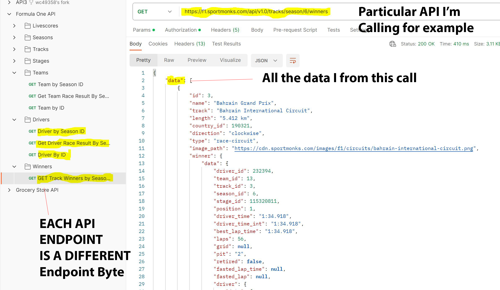
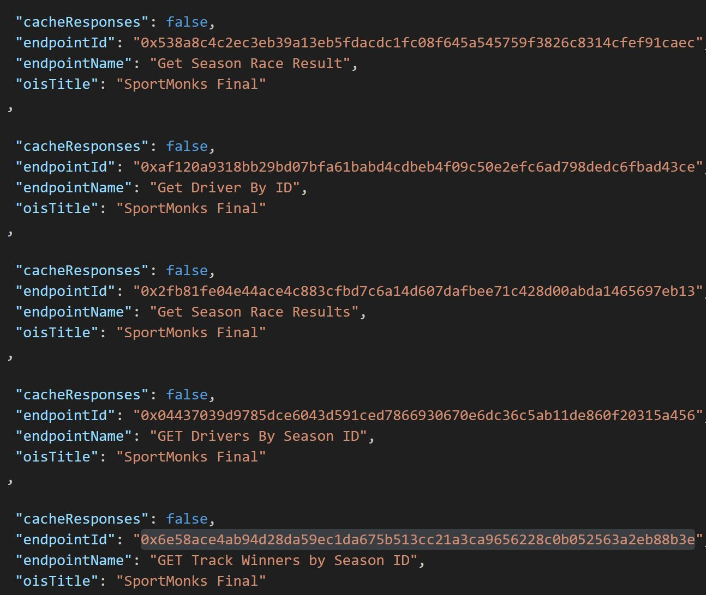
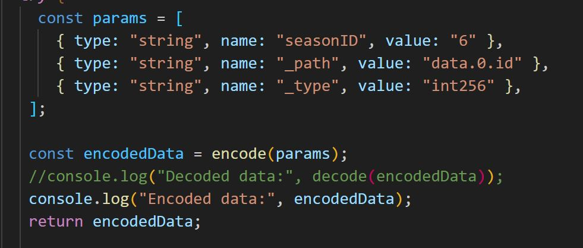

# Bringing offchain API data onchain to use a Prediction market on BASE network

In this project, I deployed an Airnode to BASE testnet. Lacking the ability to use unlimited offchain sports APIs, I used chainAPI to bring the Sportsmonk F1 sports API to be usable on the smart contract level by bringing the data onchain to settle any predictions on BASE network.  

**Deployed Front End:**
- [Front End](https://prediction-base.vercel.app/)

## How it Works
### With the ability to insure your positions with APE Coin

I deployed an Airnode on AWS to host the API data being pulled from Sportsmonk.  The airnode has a smart contract address to distinguish with chain it will be receiving the request from(BASE Testnet).  It also has an endpoint to receive the GET request.  With this setup, I can request different parameters depending on the API call.  I chose to use the winner ID for the grand prix as an example.

Here a user can predict which driver will win the Grand prix for the season. They can put a postion in ETH for a chance to win a prize, and they can also ``insure their position with APE coin``.  Leveraging API3's dapi onchain price feeds, the contract checks the value of ETH and APE coin being placed and in order to insure the postions, the APE coin insurance must be at least 25% of the ETH position value.  If the racer loses or doesn't finish the race, insured predictors get half their postion back and burn their insurance.

Once all predications are placed and the race has concluded, the request to the api can be called.  The smart contract calls on the airnode in one transaction.  The Airnode gets the API data and then returns it in a 2nd transactions back to our smart contract.  In order to pay for the gas of the 2nd transaction, we use a sponsor wallet that will pay for the gas logic when the data is returned.

The contract will check for the winnining number of the racer (the data that was requested) and compare it to the structs of all the betters and pay out winners and insured users. 

## Details

``sportsmonk_airnode`` config files contain the config.json and reciept.json files generated by the chainAPI scripts to generate the smart contract files needed to communicate with the offchain data setup in the airnode.

### Sample of endpoint options

### Script used for this example
It must be encoded to be passed through the request and the decoded on the smart contract

1. **Contract Address:**
   - [0xBA18f2DC2Ce0B971f33236fdf76E227bf9D8dDBd](https://goerli.basescan.org/address/0xba18f2dc2ce0b971f33236fdf76e227bf9d8ddbd)

2. **Sponsor Wallet:**
   - [0x6c33312c753cAc450fD800D297E019135895bc0B](https://goerli.basescan.org/address/0x6c33312c753cAc450fD800D297E019135895bc0B)

3. **APE Coin:**
   - [0xb8EAa40a7976474a47bB48291FE569f383069FBc](https://goerli.basescan.org/address/0xb8eaa40a7976474a47bb48291fe569f383069fbc)

